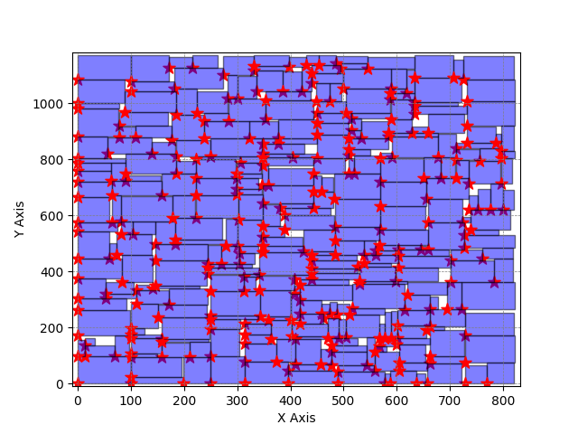

# B*-Tree floorplanning with Aspect Ratio Constrain

* **red-star** : Position of block
* **purple rectangle** : Block

---

Aspect ratio constrain : [0.3, 2.5] \
Designed aspect ratio = 0.793296

---

Aspect ratio constrain : [0.1, 1.9] \
Designed aspect ratio = 0.702602

---

Aspect ratio constrain : [0.1, 1.75] \
Designed aspect ratio = 0.701365

